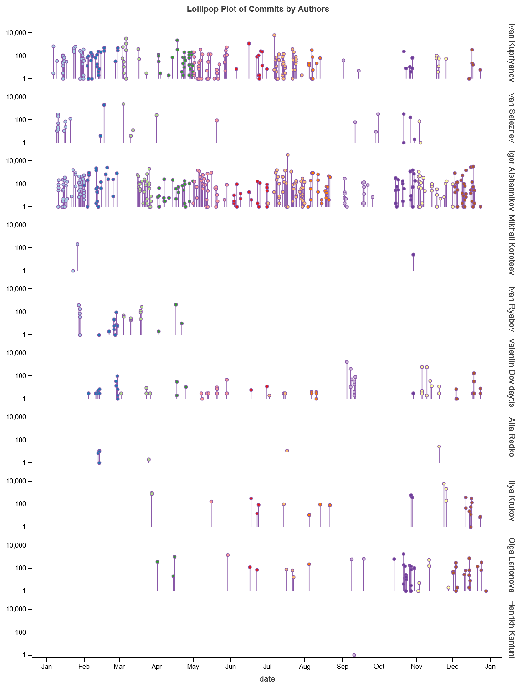
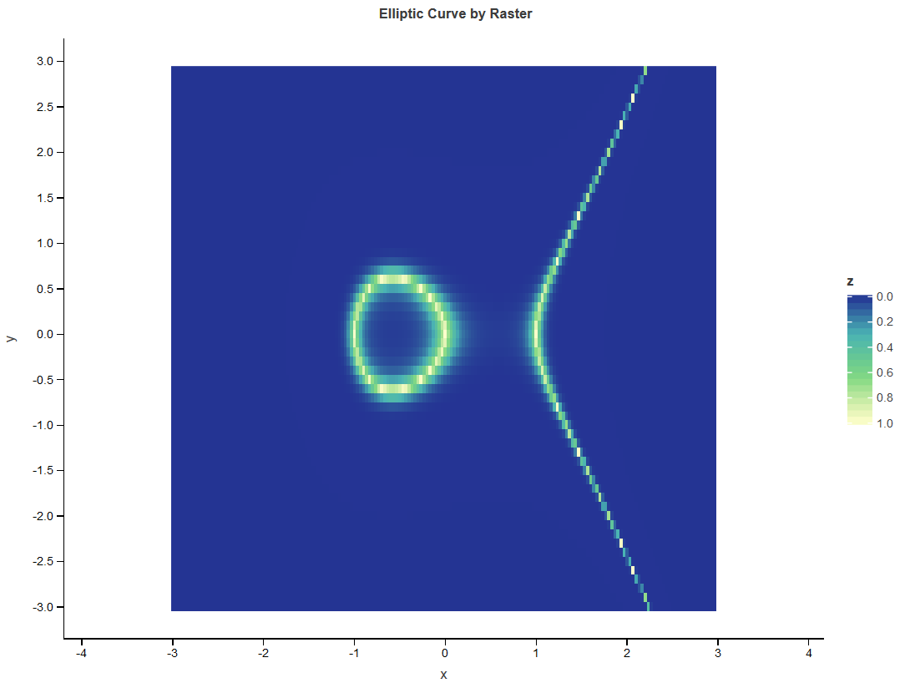

# General Demo

The main directory with demo notebooks.

All viewable or executable notebooks are available here:

## Lets-Plot in 2020

## How To Draw Curve Fast

## Population mobility and COVID-19

## COVID-19 by Country

## COVID-19 Statistics in China (except Hubei)

## Delhi Climate

## Inset Map of Kotlin Island

## Google Play Store

## Google Suggestions

## Internet use and activities in Europe

## Malnutrition in the World

## Exploring Minard's 1812 Plot with Lets-Plot

## Mosaic Art

## US Museums

## NYC Subway With BigQuery

## Saint-Petersburg Bakeries

## Minimalistic World Coloring

