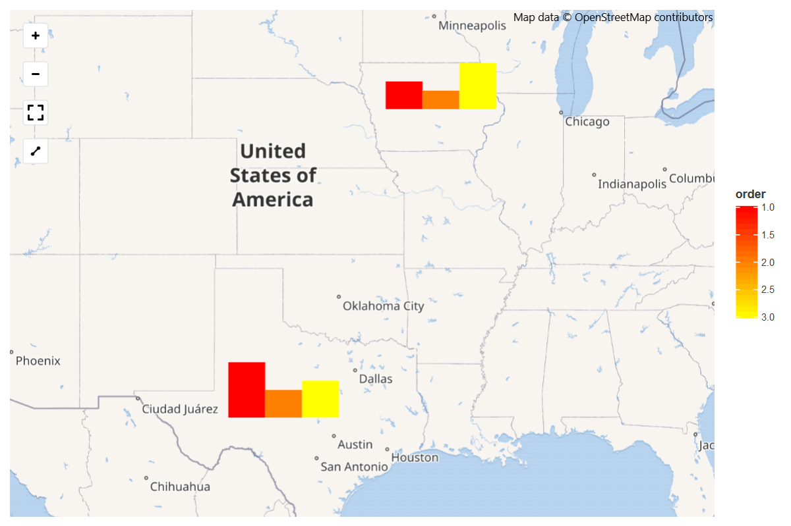
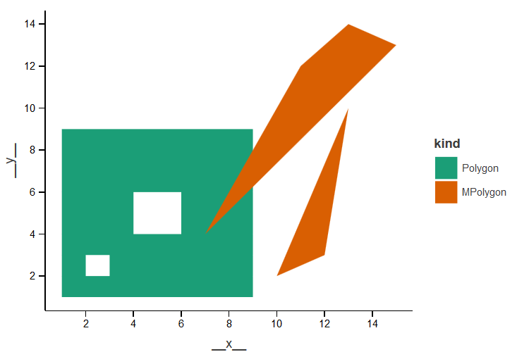
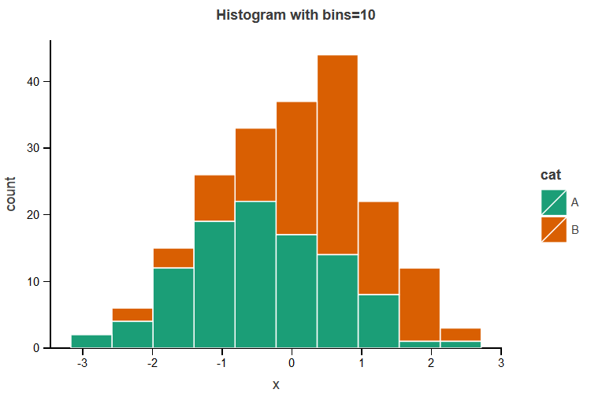
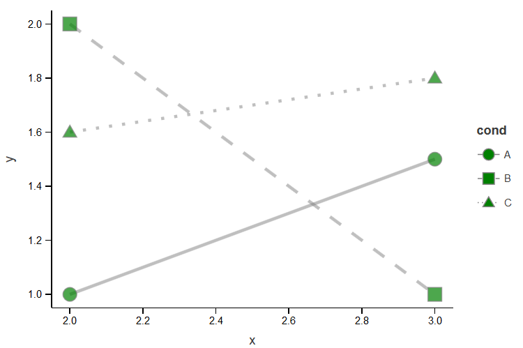
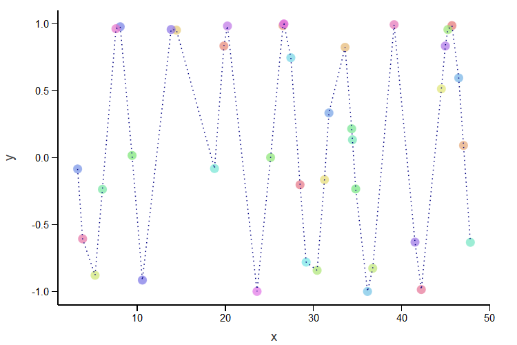
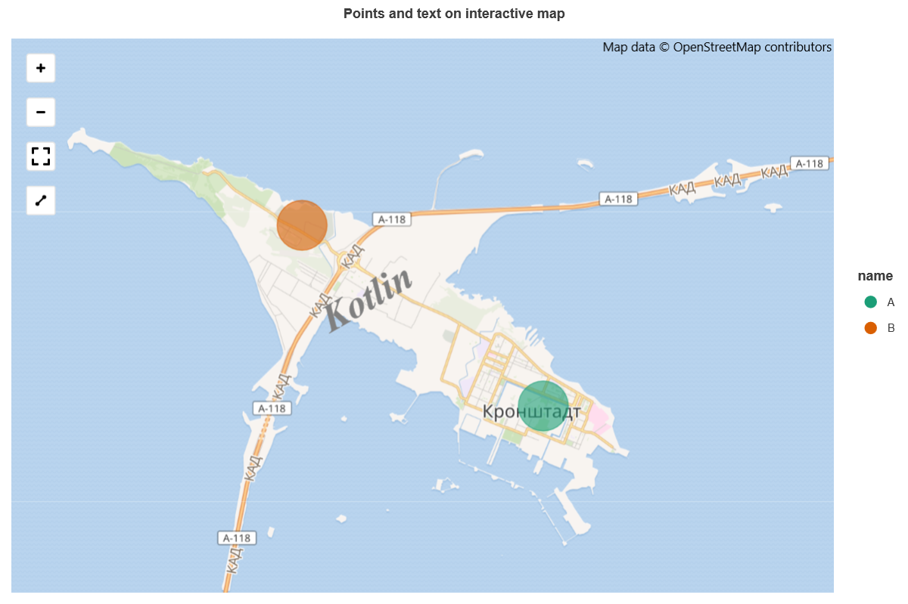
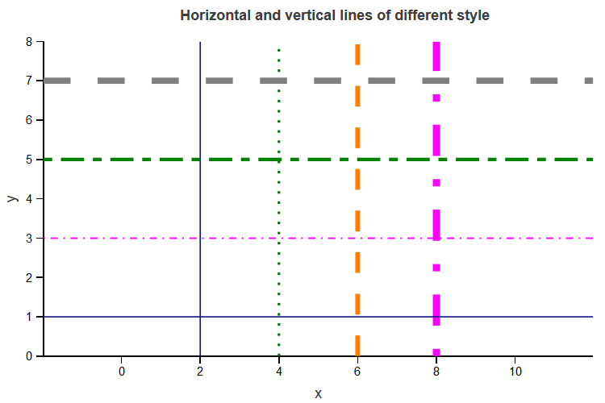

# Features Demo

Simple demo notebooks to demonstrate some features of Lets-Plot.

All viewable or executable notebooks are available here:

## Bar

## Bar on Livemap

## GeoDataFrame on Plot

## Histogram

## Line Type and Point Shape

## geom_line() and geom_path()

## Points and Text on Livemap

## Straight Lines

