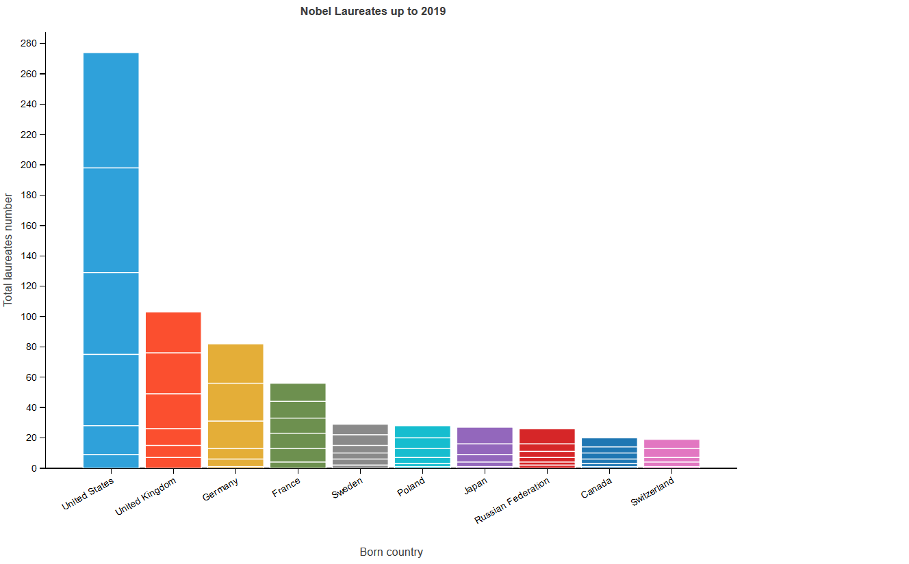
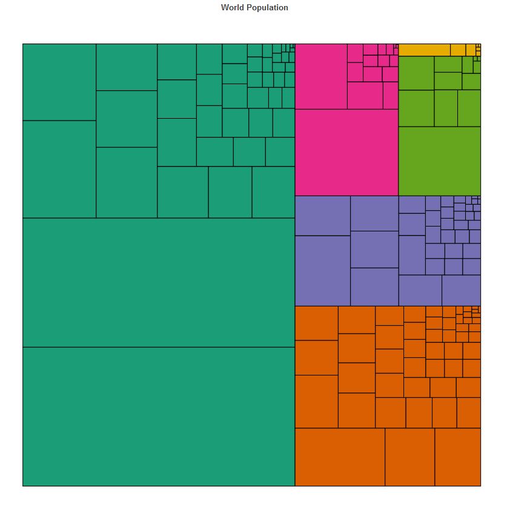

# Plans Demo

Demo notebooks with features that have not been implemented in Lets-Plot yet.

All viewable or executable notebooks are available here:

## Animated Bar Chart

## Cropped Image

## Treemap

## Waffle Chart

