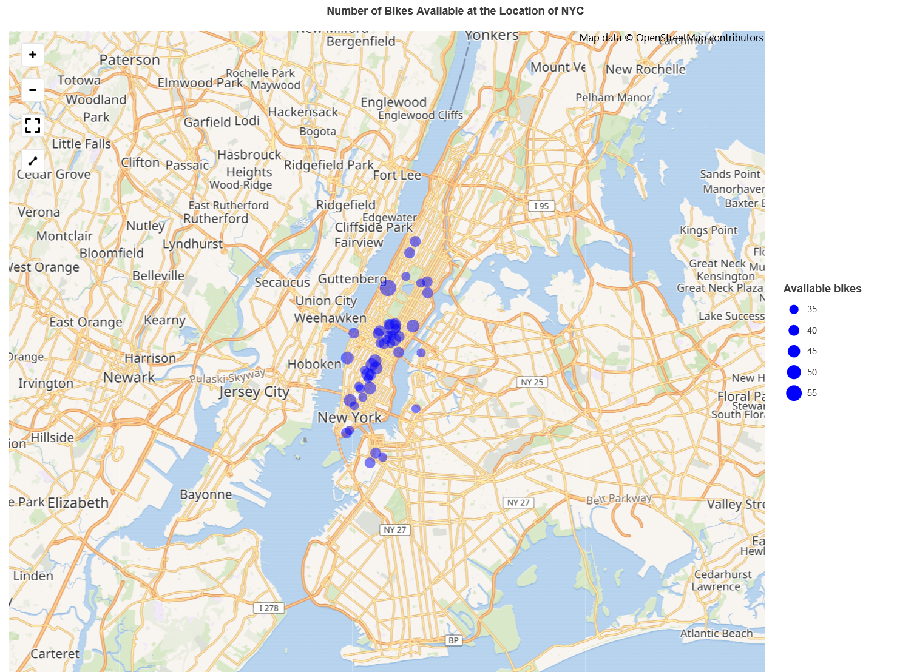
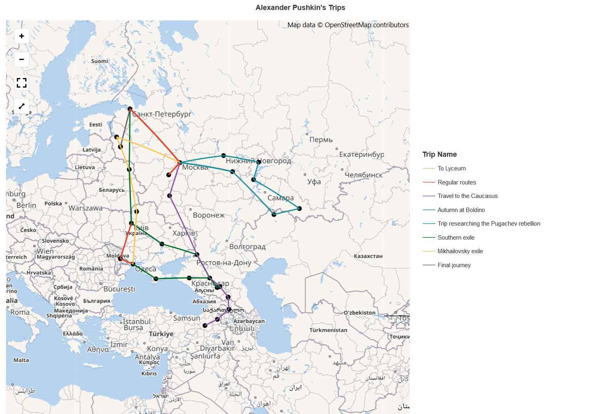

# Remakes Demo

Demo notebooks that remake those from the web which do not use Lets-Plot.

## Getting started with BigQuery GIS

You should run [this notebook](nyc_bikes.ipynb) on your local Jupyter server.

## Pushkin as Traveller

